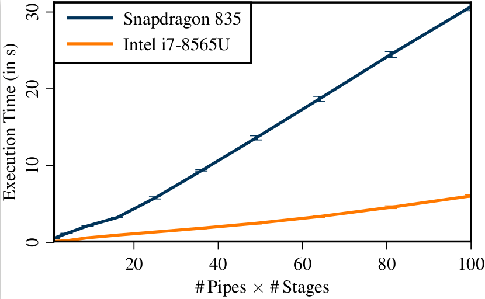

# GNU Radio Benchmarks for Android

This is an Android app that benchmarks GNU Radio. Similar to [our paper](https://www.bastibl.net/bib/bloessl2019benchmarking/), it looks into the scaling behavior of the runtime environment for a large number of blocks. Please see the paper for more information on the experiment setup.

Besides runtime performance, it also compares the throughput of OpenCL accelerated blocks with upstream GNU Radio blocks. These measurements are adapted from [gr-clenabled](https://github.com/ghostop14/gr-clenabled). Note that there is no Android OpenCL API, i.e., this requires some manual setup of the libraries (mainly copying OpenCL libraries from the phone into the toolchain on the PC, see the documentation of the [GNU Radio Android toolchain](https://github.com/bastibl/gnuradio-android/)).

Most of the GNU Radio blocks that are compared to OpenCL use Volk. So make sure to run [volk profile](https://github.com/bastibl/android-volk/) before running the measurements.

The results stored as CSVs on *External Storage* (which might be an SD card or some internal storage).

## Installation

Building the app requires the [GNU Radio Android toolchain](https://github.com/bastibl/gnuradio-android/). Please see this repository for further instructions on how to build the toolchain and apps that use it.

## Running the App

The app is minimalistic. There are only three buttons to start the three different measurements (runtime buffers, runtime async message, OpenCL vs CPU).

## Exemplary Results
=
Scaling of GNU Radio data streams on a OnePlus 5T smartphone vs a similar setup on a laptop with an i7.

Throughput of OpenCL kernels with increasing buffer sizes.

## Publication

If you use this project, we would appreciate a reference to:

<ul>
<li>
 <a class="bibauthorlink" href="https://www.bastibl.net/">Bastian Bloessl</a>, Lars Baumgärtner and Matthias Hollick, “<strong>Hardware-Accelerated Real-Time Stream Data Processing on Android with GNU Radio</strong>,” Proceedings of 14th International Workshop on Wireless Network Testbeds, Experimental evaluation &amp; Characterization (WiNTECH’20), London, UK, September 2020.
 <small>[<a href="http://dx.doi.org/10.1145/3411276.3412184">DOI</a>, <a href="https://www.bastibl.net/bib/bloessl2020hardware/bloessl2020hardware.bib">BibTeX</a>, <a href="https://www.bastibl.net/bib/bloessl2020hardware/">PDF and Details…</a>]</small>

</li>
</ul>
